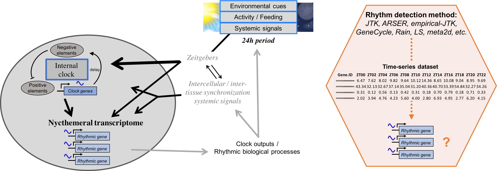
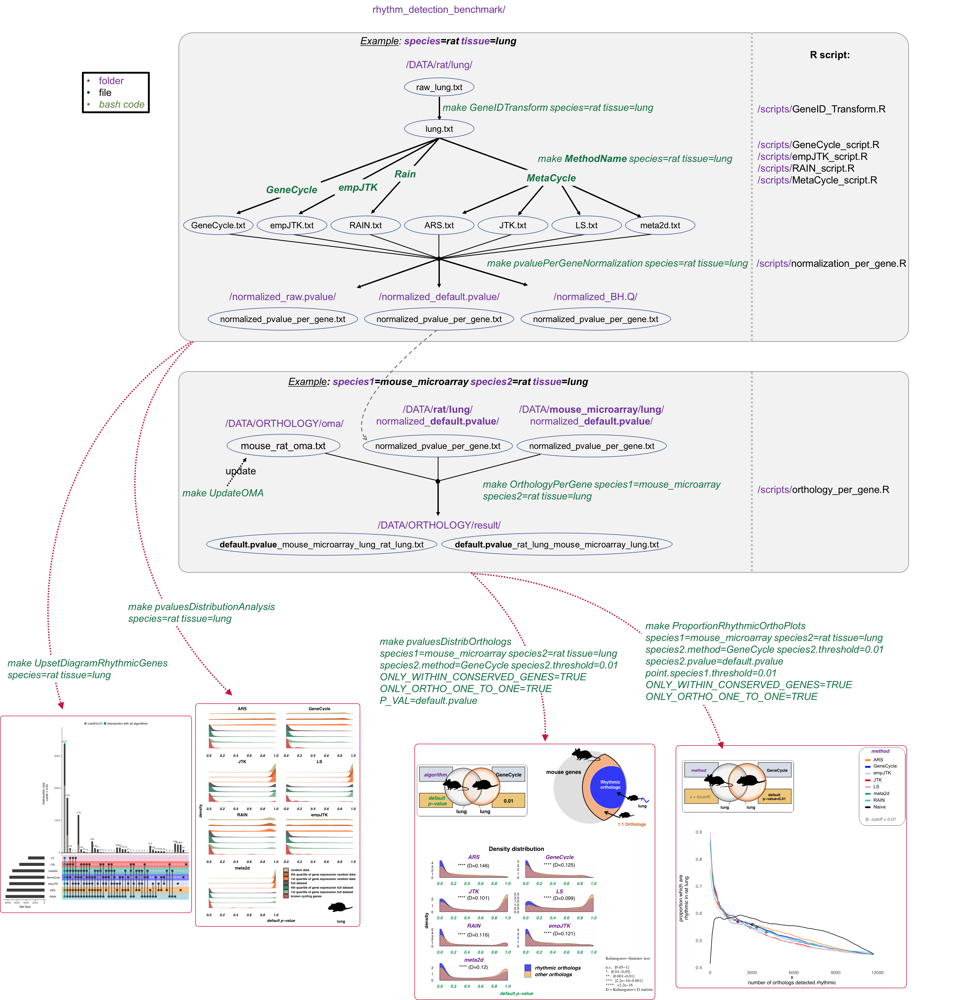

# Benchmarking of seven methods detecting rhythmic patterns in gene expression time-series <br /> <br /> 

This repository contains data and reproducible code for [Laloum and Robinson-Rechavi benchmark paper](https://www.biorxiv.org/content/10.1101/730937v2). This pipeline has been developed for the Benchmarking analysis on which results have been obtained, but can also be used for other datasets or algorithms. Please follow instructions for dataset raw structure integration.

Main figures of the paper are available by subsets into ```paper_main_figures``` folder.

## Prerequisites
### DATA includes:
- Time-series datasets from 7 species: *Aedes aegypti, Anopheles gambiae, Papio anubis, Drosophila melanogaster, Mus musculus, Rattus norvegicus*, and *Dano rerio*. Please see our [paper](https://www.biorxiv.org/content/10.1101/730937v2) for the references from where these data come.
- Orthology relationships from [OMA](https://omabrowser.org/oma/home/).
- images

### Raw dataset:
Must be a .txt file, with \t (tabular) separation. First column name must be "ID", and all other columns are time-points such as ZT24 or CT24. First column can contain Prob.ID or Gene.ID, even with several data for the same Gene.ID. Biological replicates must be transformed into one new cycle such as:
*ZT06.rep1 and ZT06.rep2* must become *ZT06 and ZT30*. <br />
This step is essential for some algorithms, but some of them can deal with biological replicates. In this last case, you can leave *ZT06* several times.

### Add a new algorithm:
If you want to test a new algorithm, please add its name among the choices into ```R``` codes: ``empJTK|RAIN|JTK|LS|ARS|meta2d|GeneCycle|newAlgorithm``

## Running pipeline environment step by step:
Download the ```rhythm_detection_benchmark``` repository into your local ```Documents``` folder.
```
cd ~/Documents/
git clone https://github.com/laloumdav/rhythm_detection_benchmark.git
cd rhythm_detection_benchmark/
```

### Makefile
The **Makefile** centralizes the main analysis allowing to re-run everything and to generate results plots in .pdf format directory from bash commands. <br />
```
make help #Displays the various functions. 
``` 


**_Since processed data are already provided in this GitHub, you can directly go to steps 4-5 and 7-8 to generate plots._**

### 1) From raw file, transform to GeneIDs (not unique) ###
*example: let's work with the original data:* **raw_lung.txt** *of the* **rat** *located here:* ``rhythm_detection_benchmark/DATA/rat/lung/raw_lung.txt``

The cross-reference IDs file must be in ``rhythm_detection_benchmark/DATA/species/`` folder and called: speciesname_ProbID_GeneID.txt or speciesname_TranscriptID_GeneID.txt.
```
make GeneIDTransform species=rat tissue=lung
```
!!!   For the mouse, use ```species=mouse_microarray``` or ```species=mouse_RNAseq```   !!!

This step keeps only protein-coding genes, removes prob.ID referred to several Gene.IDs, and removes genes with NO expression (=0) at all time-points. <br />
### 2) Running algorithms (RAIN, empJTK, GeneCycle, and MetaCycle which include JTK, LS, ARS, and meta2d) ###
```
# Long process #
make RAIN species=rat tissue=lung
make empJTK species=rat tissue=lung
make GeneCycle species=rat tissue=lung
make MetaCycle species=rat tissue=lung
# Long process #
```

``R`` packages required before running: [`readr`](https://CRAN.R-project.org/package=readr), [`plyr`](https://CRAN.R-project.org/package=plyr), [`GeneCycle`](https://CRAN.R-project.org/package=GeneCycle) (version 1.1.4).

### 3) Normalization of p-values per gene (ProbIDs/TranscriptsIDs -> uniqueGeneID) ###
Normalize p-values after rhythmic detection to obtain a unique p-value per gene. Normalization possible by method mean, fisher, kost, brown, etc. Default normalization method: **Brown**.
```
# Can be a long process #
make pvaluePerGeneNormalization species=rat tissue=lung
```

Contents of **normalized_pvalue_per_gene.txt** file: <br />
- If normalization needed (several data possible for a unique gene), several normalization method are proposed: "ID", "pvalue_mean", "pvalue_brown", "pvalue_fisher", "pvalue_kost", "pvalue_logitp", "pvalue_sumlog", "pvalue_sump" , "pvalue_sumz", "algorithm" <br />
- Otherwise: "ID", "pvalue", "algorithm" <br />

The choice of the normalization method is made later in the ``R`` codes.
Default normalization method: **Brown**. If you want to use another normalization method, modify the *rhythm_detection_benchmark/scripts/normalization_parameters.csv* file and write the method you want: column *normalization_method* and row *per_gene*.

``R`` packages required before running: [`EmpiricalBrownsMethod`](http://bioconductor.org/packages/EmpiricalBrownsMethod/) ([`see below`](https://github.com/laloumdav/rhythm_detection_benchmark#r-packages)), [`plyr`](https://CRAN.R-project.org/package=plyr), [`metap`](https://CRAN.R-project.org/package=metap)

### 4) Generate the plots of density distribution of p-values: ###
This step creates 3 pdf files into ``rhythm_detection_benchmark/RESULTS/pval_distrib_images/`` : <br />
- raw.pvalue_distrib_rat_lung.pdf <br />
- default.pvalue_distrib_rat_lung.pdf <br />
- BH.Q_distrib_rat_lung.pdf <br />
```
make pvaluesDistributionAnalysis species=rat tissue=lung
# To see one of these files:
open RESULTS/pval_distrib_images/default.pvalue_distrib_rat_lung.pdf
```

``R`` packages required before running: [`RColorBrewer`](https://www.rdocumentation.org/packages/RColorBrewer/versions/1.1-2/topics/RColorBrewer), [`tidyverse`](https://CRAN.R-project.org/package=tidyverse), [`wesanderson`](https://CRAN.R-project.org/package=wesanderson), [`magick`](https://CRAN.R-project.org/package=magick), [`ggridges`](https://CRAN.R-project.org/package=ggridges) (version 0.5.1), [`cowplot`](https://CRAN.R-project.org/package=cowplot) (version 0.9.4)

### 5) UpSet plot of rhythmic genes called in common: ###
This step creates 6 pdf files into ``rhythm_detection_benchmark/RESULTS/UpSet_images/`` : <br />
```
make UpsetDiagramRhythmicGenes species=rat tissue=lung
# To see one of these files:
open RESULTS/UpSet_images/upset_DEGREE_default.pvalue_rat_lung.pdf
```

``R`` packages required before running: [`venn`](https://CRAN.R-project.org/package=venn), [`UpSetR`](https://CRAN.R-project.org/package=UpSetR), [`wesanderson`](https://CRAN.R-project.org/package=wesanderson), [`plyr`](https://CRAN.R-project.org/package=plyr)

### 6) Generate files with orthology informations: ###
Orthology relationships files are into ``rhythm_detection_benchmark/DATA/ORTHOLOGY/oma/`` <br />
You can update these files by running the command:
```
make UpdateOMA #Optional
```

*example:* ***mouse (microarray)*** *compared with the* ***rat***, *same tissue* (***lung***)

This step creates 6 files (x3 species1-species2 and x3 species2-species1) into ``rhythm_detection_benchmark/DATA/ORTHOLOGY/result/`` :
- default.pvalue_mouse_microarray_lung_rat_lung.txt <br />
- raw.pvalue_mouse_microarray_lung_rat_lung.txt <br />
- BH.Q_mouse_microarray_lung_rat_lung.txt <br />
- default.pvalue_rat_lung_mouse_microarray_lung.txt <br />
- raw.pvalue_rat_lung_mouse_microarray_lung.txt <br />
- BH.Q_rat_lung_mouse_microarray_lung.txt <br />
```
make OrthologyPerGene species1=mouse_microarray species2=rat tissue=lung
# To see one of these files:
open DATA/ORTHOLOGY/result/raw.pvalue_mouse_microarray_lung_rat_lung.txt
```

In case of multiple orthologs such as **1:m**, **n:m**, we calculate a unique p-value (output from rhythmic detection) per orthologs group **m** using the normalization method selected in *scripts/normalization_parameters.csv* file. Default normalization method is **min(bonferroni_pvalues)**. For each species1-species2 comparison file, this per-orthologs group **m** normalization was done for species2 orthologs.

By default, same homologous tissues are compared (`tissue=lung`). Otherwise write ``tissue1=lung tissue2=kidney`` to use the lung dataset of species1 and the kidney dataset of species2.

To generate all possible combinations, run:
```
chmod +x OrthologyPerGene_running.sh
./OrthologyPerGene_running.sh   # Long process #
```

``R`` packages required before running: [`aggregation`](https://CRAN.R-project.org/package=aggregation)

### 7) p-values density distribution plots of rhythmic orthologs vs non-rhythmic orthologs
*p*-values are output of algorithms applied to *tissue* dataset of *species1*. Orthologs are species1-species2 orthologous genes. Rhythmic orthologs are orthologous genes detected rhythmic in the *tissue* of *species2* using *species2.method* and *P_VAL* < *species2.threshold*

*example:* ***mouse (microarray)*** *compared with* ***rat***, *same tissue* (***lung***), ***rhythmic orthologs*** *are mouse-rat orthologous genes detected rhythmic in rat lung using* ***GeneCycle*** *and* ***default.pvalue ≤ 0.01***

This step creates the plot in pdf format into: ``rhythm_detection_benchmark/RESULTS/ortho_pval_distrib_images/``
```
make ProportionRhythmicOrthoPlots species1=mouse_microarray species2=rat tissue=lung species2.method=GeneCycle species2.threshold=0.01 species2.pvalue=default.pvalue point.species1.threshold=0.01 ONLY_WITHIN_CONSERVED_GENES=TRUE ONLY_ORTHO_ONE_TO_ONE=TRUE
# To see the plot:
open RESULTS/ortho_pval_distrib_images/default.pvalue_ORTHO_distrib_mouse_microarray_rat_lung.pdf
```

``P_VAL`` should be among: ``raw.pvalue``, ``default.pvalue``, or ``BH.Q``

``R`` packages required before running: [`ggplot2`](https://CRAN.R-project.org/package=ggplot2) (version 3.1.0), [`reshape2`](https://CRAN.R-project.org/package=reshape2), [`RColorBrewer`](https://www.rdocumentation.org/packages/RColorBrewer/versions/1.1-2/topics/RColorBrewer), [`MASS`](https://CRAN.R-project.org/package=MASS), [`aggregation`](https://CRAN.R-project.org/package=aggregation), [`magick`](https://CRAN.R-project.org/package=magick), [`ggridges`](https://CRAN.R-project.org/package=ggridges) (version 0.5.1), [`cowplot`](https://CRAN.R-project.org/package=cowplot) (version 0.9.4)

### 8) Variation of the proportion of rhythmic orthologs among all species1-species2 orthologs as a function of the number of orthologs detected rhythmic in species1.

*example:* *Variation of the proportion of rhythmic orthologs among all mouse-rat orthologs, as a function of the number of* **mouse-rat** *orthologs detected rhythmic in* **mouse**(``species1``) **lung**(``tissue``). *The benchmark gene (rhythmic orthologs) set is composed of mouse-rat orthologs, detected rhythmic in* **rat**(``species2``) **lung**(``tissue``) *by the* **GeneCycle**(``species2.method``) *method with* **default p-value**(``species2.pvalue``) **≤ 0.01**(``species2.threshold``). *The black line is the Naive method which orders genes according to their median expression levels (median of time-points), from highest expressed to lowest expressed gene, then, for each gene, calculates the proportion of rhythmic orthologs among those with higher expression. Diamonds correspond to a p-value threshold of* **0.01**(``point.species1.threshold``).

```
make ProportionRhythmicOrthoPlots species1=mouse_microarray species2=rat tissue=lung species2.method=GeneCycle species2.threshold=0.01 species2.pvalue=default.pvalue point.species1.threshold=0.01 point.species1.FDR.threshold=FALSE ONLY_WITHIN_CONSERVED_GENES=TRUE ONLY_ORTHO_ONE_TO_ONE=TRUE

## To see the plot:
open RESULTS/proportion_rhythmic_orthologs_images/GeneCycle_default.pvalue_RATIO_mouse_microarray_rat_lung.pdf
```

``R`` packages required before running: [`ggplot2`](https://CRAN.R-project.org/package=ggplot2) (version 3.1.0), [`wesanderson`](https://CRAN.R-project.org/package=wesanderson), [`tidyverse`](https://CRAN.R-project.org/package=tidyverse), [`reshape2`](https://CRAN.R-project.org/package=reshape2), [`RColorBrewer`](https://www.rdocumentation.org/packages/RColorBrewer/versions/1.1-2/topics/RColorBrewer), [`ggforce`](https://CRAN.R-project.org/package=ggforce), [`aggregation`](https://CRAN.R-project.org/package=aggregation), [`magick`](https://CRAN.R-project.org/package=magick), [`ggridges`](https://CRAN.R-project.org/package=ggridges) (version 0.5.1), [`cowplot`](https://CRAN.R-project.org/package=cowplot) (version 0.9.4)

## Workflow


## Versioning
- All ```R``` scripts have been written in ```R``` version 3.3.3
- empirical-JTK (empJTK) uses ```Python``` version 2.7.10.

## R packages
To install [`EmpiricalBrownsMethod`](http://bioconductor.org/packages/EmpiricalBrownsMethod/) ```R``` package, run in ```R```:
``` go
source("https://bioconductor.org/biocLite.R")
biocLite("EmpiricalBrownsMethod")
library(EmpiricalBrownsMethod)
```

## Author
David Laloum
